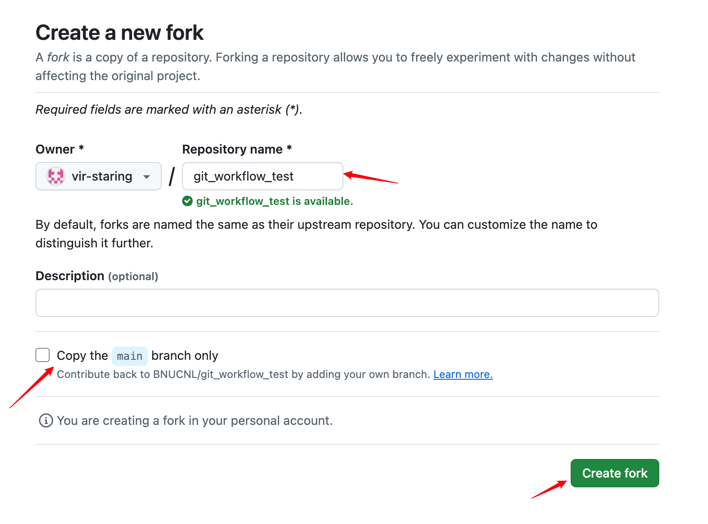

## Github/Git worklow 手册


### 概述

本手册提供了一套高效的 GitHub 工作流，用于协作开发和代码管理。主要流程如下：

1. **Fork 仓库**：从公共项目创建个人副本，实现独立开发，同时保持与原始项目的同步能力。
2. **本地克隆**：将 fork 后的仓库克隆到本地环境，便于离线开发和版本控制。
3. **配置远程仓库**：添加上游仓库（upstream）地址，用于跟踪和集成原始项目的更新。
4. **基于分支开发**：在独立分支中开发新功能，避免污染主分支，确保分支管理规范。
5. **同步上游更新**：在开发前与上游仓库同步代码，减少代码冲突风险。
6. **提交更改**：通过 `add` 和 `commit` 将代码改动保存，并推送到个人远程仓库。
7. **创建 Pull Request (PR)**：将新功能或改动通过 PR 提交至上游仓库，供维护者审核。
8. **审核与修改**：根据项目维护者的反馈优化代码，并持续更新 PR。
9. **合并 PR**：审核通过后，将代码改动合并到上游仓库的主分支。
10. **清理分支**：在 PR 生命周期结束后删除本地和远程的临时分支，避免分支管理混乱。

**建议首先阅读git官方手册中的[git是什么](https://git-scm.com/book/zh/v2/%e8%b5%b7%e6%ad%a5-Git-%e6%98%af%e4%bb%80%e4%b9%88%ef%bc%9f)和[分支简介](https://git-scm.com/book/zh/v2/Git-%e5%88%86%e6%94%af-%e5%88%86%e6%94%af%e7%ae%80%e4%bb%8b)，了解git的基本原理和git最重要的分支功能**

部分概念解释：

**本地仓库**：存储在自己电脑上的代码仓库，用于本地开发。

**远程仓库**：存储在服务器上的代码仓库，如 GitHub、GitLab。

**个人仓库**：属于个人账户的仓库，只有你能完全管理。

**公共仓库**：开放给所有人访问（一般只读）的仓库，通常用于开源项目，修改需通过PR。

**分支（Branch）**：代码的平行开发版本，用于新功能或修复的开发。

**Fork**：复制一个别人的仓库到自己的账户下，方便独立修改。

**PR（Pull Request）**：请求将修改后的代码合并到原始仓库中。

**Issue**：用来记录 Bug、功能请求或讨论的任务跟踪工具。

----

### 1. fork

**如下图所示点击公共仓库的dashboard中的fork按钮，选择“Create a new fork”**


**点击后自动跳转到新的页面，一切默认(此处不选择只fork原仓库的main分支，因为我们还需要fork自己的工作分支，该分支由管理员在公共仓库创建)，点击“Create fork”按钮即可。稍等片刻，即可在自己的 GitHub 仓库列表中看到 Fork 后的仓库（个人仓库）。**




### 2. clone	

**如下图所示，点击"code"按钮，任选一种地址格式（推荐配置ssh，使用ssh地址clone）复制**


**代码运行示例：**

```bash
# git clone <repo-url>，该命令会将仓库的所有内容clone到你运行该命令的路径下
❯ git clone git@github.com:vir-staring/git_workflow_test.git
Cloning into 'git_workflow_test'...
Enter passphrase for key '/Users/starvir/.ssh/id_rsa':#此处我选择的是ssh地址，http地址的输出和需要输入的信息有些许不同
remote: Enumerating objects: 3, done.
remote: Counting objects: 100% (3/3), done.
remote: Total 3 (delta 0), reused 3 (delta 0), pack-reused 0 (from 0)
Receiving objects: 100% (3/3), done.
# clone 成功，如果url地址正确，clone失败的原因一般都是网络问题，所以请自备魔法
# 切换至仓库目录内
❯ ls
git_workflow_test
❯ cd ./git_workflow_test
❯ ls
README.md
# 以下命令可以列出当前仓库设置的远程仓库的地址，可以发现clone操作成功后，git会自动设置并命名clone仓库的url为origin
❯ git remote -v
origin	git@github.com:vir-staring/git_workflow_test.git (fetch)
origin	git@github.com:vir-staring/git_workflow_test.git (push)
```

### 3. 添加远程仓库和上游仓库

**git 会自动我们设置了clone仓库的远程地址（即个人仓库的地址），但我们的同步源是公共仓库的地址（也被称为上游仓库）。因此，我们需要手动添加公共仓库的远程地址，以确保能够同步最新改动。**


**代码示例**：

```bash
# 查看当前设置的远程仓库地址
❯ git remote -v
origin	git@github.com:vir-staring/git_workflow_test.git (fetch)
origin	git@github.com:vir-staring/git_workflow_test.git (push)
# 使用 git remote add <url> 添加公共仓库的地址
❯ git remote add upstream git@github.com:BNUCNL/git_workflow_test.git
# 下面这一步十分重要，我们在fork仓库中的任何提交都应该通过PR，而不是push，因此这里设置push地址为无效地址
❯ git remote set-url --push upstream no_push
# 正确设置之后的远程仓库地址应如以下所示
❯ git remote -v
origin	git@github.com:vir-staring/git_workflow_test.git (fetch)
origin	git@github.com:vir-staring/git_workflow_test.git (push)
upstream	git@github.com:BNUCNL/git_workflow_test.git (fetch)
upstream	no_push (push)
```

**本地的代码变更永远只提交到 origin，然后通过 origin 提交 Pull Request 到 upstream**！！！

### 4. 同步

在进行开发和工作前检查仓库是否已和公共仓库同步，未同步需同步后进行后续的开发，由于个人仓库中大部分的开发内容位于个人工作分支中，因此同步的过程为先将个人仓库的main分支和公共仓库的main分支同步，然后将个人仓库中main分支的更改合并到个人工作分支。

#### 4.1 同步main分支

类似如下情况：BNUCNL的仓库（也就是源仓库）新增了一个feature C，但是本人仓库中并没有这个内容，此时我们就需要进行同步，一般我们在每次正式开发之前都要先和公共仓库同步一下

```bash
# 在main分支下操作
❯ git checkout main
Switched to branch 'main'
Your branch is up to date with 'origin/main'.
❯ git pull upstream main
Enter passphrase for key '/Users/starvir/.ssh/id_rsa':
remote: Enumerating objects: 5, done.
remote: Counting objects: 100% (5/5), done.
remote: Compressing objects: 100% (2/2), done.
remote: Total 3 (delta 0), reused 0 (delta 0), pack-reused 0 (from 0)
Unpacking objects: 100% (3/3), 941 bytes | 313.00 KiB/s, done.
From github.com:BNUCNL/git_workflow_test
 * branch            main       -> FETCH_HEAD
 * [new branch]      main       -> upstream/main
Updating 351294e..501dfd4
Fast-forward
 README.md | 2 ++
 1 file changed, 2 insertions(+)
# 如果想要再更新到github服务器中，需要将本地更新push到个人仓库中
```

#### 4.2 将同步内容合并至个人工作分支

 由于个人的主要开发是在个人工作分支中完成的，因此我们还需要将main分支同步后的内容合并至个人工作分支中

```bash
❯ git checkout zyj_branch
Switched to branch 'zyj_branch'
❯ git merge --no-ff main
Already up to date.
```

### 5. PR

通过PR向公共仓库中提交更改，本流程涉及到PR到过程有：使用PR提交更新到公共仓库的main分支；使用PR提交更新到公共仓库的个人工作分支

#### 5.1 使用PR提交更新到公共仓库的main分支

**在正确同步公共仓库之后，我们就可以进行自己代码的编写了，但是为保证公共仓库分支的提交日志的干净整洁，我们的提交应该最好单独放在一个分支上（分支是git中极其重要的一个概念，使用git请务必理解分支概念，推荐阅读：[分支简介](https://git-scm.com/book/zh/v2/Git-%e5%88%86%e6%94%af-%e5%88%86%e6%94%af%e7%ae%80%e4%bb%8b)，此外对于git的基本原理推荐阅读：[git是什么](https://git-scm.com/book/zh/v2/%e8%b5%b7%e6%ad%a5-Git-%e6%98%af%e4%bb%80%e4%b9%88%ef%bc%9f)）**

**git add/commit示意图：**


**代码示例：**

```bash
# git checkout <branchname> 命令的翻译为“检出”，此处可以简单理解为将目前的工作环境切换至对应的分支，因为我们新的分支应该“基于”main分支创建
❯ git checkout zyj_branch
Already on 'main'
Your branch is up to date with 'origin/main'.
# git checkout -b <branch-name> 该命令的作用是基于当前所在分支创建新的分支，并切换至新创建的分支
❯ git checkout -b zyj_PR
Switched to a new branch 'zyj_PR'
# 此处创建分支的工作已经完成，我们即可使用常用的编辑器或IDE进行在项目目录下进行新代码的开发，请注意，新的开发内容应该尽量避免更改任何公共类
...
...
...
# 开发完毕后，代码将新更改的文件名添加至“缓存区”，让git进行追踪，此处涉及git的基本工作原理
❯ git add README.md
# commit会将缓存区中的文件的更改更新至文件系统， 命令 -s 表示自动为commit log 添加签名， -m 后面紧跟的就是此次提交的日志
❯ git commit -s -m "zyj_PR"
[feat-zyj 93745b1] add new feature
 1 file changed, 2 insertions(+)
# push 命令在同步时已经使用过了，就是将本地的更改提交至github服务器上的仓库
❯ git push origin zyj_PR
Enter passphrase for key '/Users/starvir/.ssh/id_rsa':
Enumerating objects: 5, done.
Counting objects: 100% (5/5), done.
Writing objects: 100% (3/3), 300 bytes | 300.00 KiB/s, done.
Total 3 (delta 0), reused 0 (delta 0), pack-reused 0
remote:
remote: Create a pull request for 'feat-zyj' on GitHub by visiting:
remote:      https://github.com/vir-staring/git_workflow_test/pull/new/feat-zyj
remote:
To github.com:vir-staring/git_workflow_test.git
 * [new branch]      feat-zyj -> feat-zyj
```

#### 5.2 使用PR提交更新到公共仓库的个人工作分支

大致流程和以上类似，个人分支不需要再创建新的PR分支提交了，直接PR一个个人分支的commit就可以

```bash
README.md
❯ git checkout zyj_branch
branch 'zyj_branch' set up to track 'origin/zyj_branch'.
Switched to a new branch 'zyj_branch'
❯ vim ./zyj_code
❯ git add zyj_code
❯ git commit -s -m "add zyj_branch, add zyj code edit 2"
[zyj_branch b52efe6] add zyj_branch, add zyj code edit 2
 1 file changed, 2 insertions(+)
❯ git push origin zyj_branch
Enter passphrase for key '/Users/starvir/.ssh/id_rsa':
Enumerating objects: 5, done.
Counting objects: 100% (5/5), done.
Delta compression using up to 8 threads
Compressing objects: 100% (2/2), done.
Writing objects: 100% (3/3), 328 bytes | 328.00 KiB/s, done.
Total 3 (delta 0), reused 0 (delta 0), pack-reused 0
To github.com:vir-staring/git_workflow_test.git
   3166916..b52efe6  zyj_branch -> zyj_branch
```

提交到远程仓库后，可以在github页面看到PR按钮，如果没有参考上一节的操作


设置好PR源和PR目标后，提交即可


#### 5.2 创建PR

**正确进行以上操作之后，访问个人仓库的github网页，可以看到github在检测到提交后自动为你弹出了”compare & pull request“按钮，如果你的网页中没有自动弹出，也可以点击dashboard上的“pull request”菜单按钮**（详细操作在下张图）


**如果没有自动弹出的按钮：点击dashboard上的“pull request”菜单按钮后git会跳转至PR页面，此处需要自己选择compare的分支（选择自己编辑的那个分支，如果你操作正确的话肯定不是main）然后即可在下方看到自己的新内容相对于公共仓库的更改和对应的提交日志，点击“create pull request”按钮即可基于此创建一个新的PR**


**正确操作后，应该最终跳转至以下页面（如果你点击了第一张图中说的github自动弹出的 ”compare & pull request“ 按钮会直接跳转到这），填写PR的名称和具体的描述信息，确认无误后点击“create pull request”按钮即可创建一个PR**


**正确创建后的PR页面大致如下**


#### 5.3 审核PR

**在公共项目的“Pull request”页面下即可看到所有待审核的PR**


**点击进入一个PR的详细内容页面，可以查看PR到commit记录，具体改变的内容，如果无误点击“Merge pull request”按钮即可，如果仍有修改空间，可以对该PR添加评论**


**在确认PR无误后，点击“Merge pull request”按钮，选择该提交关联的邮箱信息，确认提交，该PR生命周期结束，关闭**


**可以看到PR中的内容已经合并至main分支中**


#### 5.4 修改PR

**PR收到了新的修改建议，可以在个人主页面的message box查看，根据修改意见代码即可，注意：修改完成后不需要再提交新的PR，只需要将修改的内容通过 commit 提交到个人仓库中即可， PR在关闭前会自动跟踪提交源的所有commit记录** 


#### 5.5 删除PR分支

**自己提交的PR被关闭后，私人仓库中创建的PR分支也就没有用了，防止未来误操作该分支，可以删除PR分支（危险操作，一定要在确认PR关闭后再操作）**

```bash
❯ git branch -d feat-zyj
Deleted branch feat-zyj (was 93745b1).
# -v参数可以查看目前所在仓库的所有branch的信息
❯ git branch -v
```

### 8. issue

#### 从代码段创建issue

进入仓库，点击你有疑惑的文件


**点击预览形式为 “code” ， 左键单击对应有疑惑的内容的行号（选中多行按shift同时左键单击），选中的行会变为黄色，同时行号左边有弹出一个菜单栏按钮，点击它，选择“Reference in new issue”，即可进入issue界面**


**在issue编辑界面编辑名称和详情，确认无误后点击“submit new issue”即可基于先前选择的代码段成功创建一个issue（description中的链接是github自动创建的先前选择的代码段的超链接，请勿编辑或删除）**


**成功创建后的issue：**


### A1. 创建个人工作分支

注意：**PR 本身不创建分支**，PR 是用于请求合并分支的工具，因此个人工作分支的PR必须基于 BNUCNL 的仓库下已有一个个人工作分支的情况下进行。此小节操作应由管理员完成

一个仓库只有部分人员有管理员权限，其他人只有读权限，因此个人工作分支需由管理人员统一创建，github提供了非命令行操作的创建方法：


BNUCNL下

```
❯ git checkout -b zyj_branch
Switched to a new branch 'zyj_branch'
❯ git branch -a
  main
* zyj_branch
  remotes/origin/HEAD -> origin/main
  remotes/origin/main
(END)
```

---

